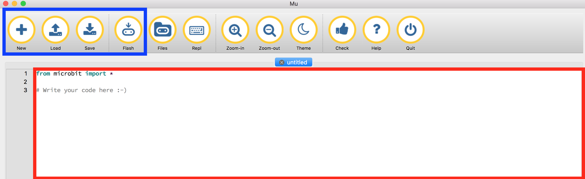
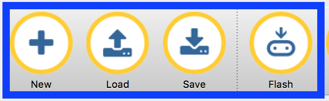
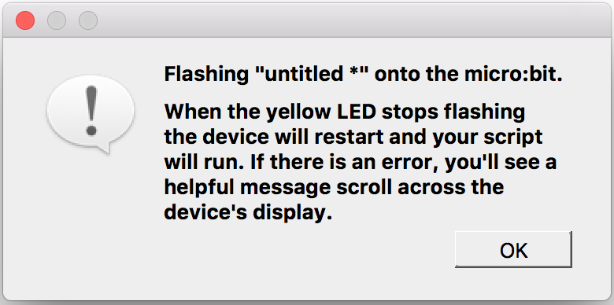

# Micro:bit & Mu editor

## Was wirst du in diesem Kapitel lernen?

* was der BBC Micro:bit ist
* in welchen Sprachen wir mit dem BBC Micro:bit sprechen können
* wie du mit deinem Micro:Bit (Mu editor) sprichst

## BBC Micro:bit
Was ist der BBC Micro:bit?

Es sollte schon in den Händen sein ..... ist ein sehr kleines Gerät, ein kleiner Computer.

Er hat 2 Hauptschalter (A und B), ein Display aus 25 roten LED's (sehr kleinen Lichtern), einem Funkmodul und ein paar Sensoren, einem Beschleunigungsmesser und einem Kompass.

Wir können die Schalter und Senoren als Eingaben (mit Eingaben geben wir dem microbit Informationen) und mit dem Display sehen wir dann entsprechende Ausgaben wie Bilder oder Text.

Du kannst deinen Mirco:bit mit dem Computer verbinden und programmieren, er hat einen micro-usb Port. Wenn du diesen anschließt wirst du ein paar LED's blinken sehen.
Er hat auch einen schmallen Anschluss an dem du eine Batterie-Box anschließen kannst. Über diesen Weg kannst du deinen Micro:Bit ohne Computer mit Strom versorgen.

## Spreche mit deinem BBC Micro:bit
Um mit deinen BBC Micro:bit sprechen zu können, brauchst du eine Sprache die er versteht: Python.

Aber wie können wir den unseren Code schreiben? Dafür können wir einen Texteditor verwenden, **Mu**.
Mu ist ein Editor der speziell zum programmieren des BBB Micro:bit gemacht wurde.

Jetzt starte Mu.

Hast du den Mu Editor schon auf deinem Computer installiert? Bitte prüfe das [page](/README.md#install-mu-editor "Install Mu editor").

## Mu editor

Wenn du das erstmal den Mu Editor startest, solltest du folgendes Bild auf deinem Bildschrim sehen.

1. Der route Bereich, ist der Bereich wo du dein Code schreibst.
2. Im blauen Bereich findest du vier wichtig Schalter.

Hier siehst du die Schalter größer.

Die vier Schalter haben folgende Bedeutung:

1. Neu: du öffnest einen neuen Tab im Mu Editor
2. Load: zum Laden von Dateien von deinem Computer
3. Save: zum Speichern deines Codes auf deinem Computer
4. Flash: diese Kommando sendet deinen Code zu deinem Micro:bit

Es gibt einen wichtigen Hinweis zu den Dateien, die Sie speichern und laden, sie sind nur Text.
Aber wie erkennen wir, dass _python_ file ist?
Anhand des Namens.

Lass uns unsere erste Datei auf deinem Computer speichern.

1. Drücken Sie die Speichern-Taste
2. Ändern Sie den Speicherort, um die Datei auf Ihrem Desktop zu speichern
2. Geben Sie den Namen für Ihre Datei ein (versuchen Sie es mit Ihrem Namen!)
3. Drücken Sie auf Speichern!

Jetzt schaue nach einer Datei... sie sollte yourname.py heißen.

Was bedeutet __.py__?

Gut Python-Code ist nur Text .... so können wir einen Python (Text)-Code durch __.py__ erkennen.
Aber mit Mu müssen wir uns nicht darum sorgen, __.py__ hinzuzufügen, denn das macht das für uns.

## Unser erstes Programm

Nun ist Mu offen, wir verbinden jetzt den Micro:bit mit dem Computer und drücken __flash__.

Wenn du eine Box ist, nicht nervös werden. Drücke einfach `OK`.

You should see the yellow led light blinking....is working!
Du solltest jetzt das gelbe LED Licht blinken sehen ... es funktioniert!

## Was ist BBC Micro:bit ?

* Eine TV Serie von BBC
* Eine Programmiersprache
* Ein kleiner Computer den man programmieren kannst
* Ein Editor

## Versuchen Sie, Ihren Mu-Editor zu öffnen, eine Datei zu speichern und diese Datei zu laden

* Was es bedeutet "programmieren"
* Was ist BBC Micro:bit
* In welcher Sprache können wir mit BBC Micro:bit sprechen
* Wie man mit deinem Mikro:bit spricht (Mu Editor)

## Das ist alles

Fertig für das nächste Kaptitel?
